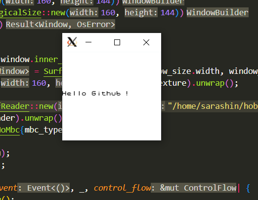

# 実装の進捗

## 第一回

Rustの勉強のために、そして計算機というものを少しでも理解するために、Rustでゲームボーイのエミュレータを実装することにしました。

とりあえず見たサイトは[これ](https://keichi.dev/post/write-yourself-a-game-boy-emulator/)

主なドキュメントと方針が書かれているので、それを参考に作っていきます。  
ドキュメントについては[こちら](https://github.com/gbdev/awesome-gbdev)も詳しいです。

### 情報収集

[Game Boyについての有名な解説動画](https://media.ccc.de/v/33c3-8029-the_ultimate_game_boy_talk)を見て、ほーん分かったような分からんようなになりました。まず早口なので英語を理解するのが結構難しい。

[もう一つの基礎的な動画](https://www.youtube.com/playlist?list=PLu3xpmdUP-GRDp8tknpXC_Y4RUQtMMqEu)の方が初心者には良いかも。特に自作OSとかでCPUやアセンブリの基本的な知識を持っていない人はこちらをおすすめします。

### ROM読み取り

まずは何から手を付けようかと思ったが、先人がROMの読み取りから手を付けていたのにならい、ROMを読み出してくる部分から書くことにし、
[Pan DocsのROM説明部分](https://gbdev.io/pandocs/The_Cartridge_Header.html)を読みます。

読んだ結果どうもメモリマップの話とかをまず理解しなければならないねということがわかったので、まとめることに......。

#### Game Boyのメモリ戦略

前提として、Game Boyには8KiBのRAMと8KiBのVRAMが搭載されています......これが2003年まで製造販売されてたってマジ？ 翌年発売のDSは4MB RAMを搭載しているんですが。というかDSが4MBなのもすごいね。

まあそんなことはいいや。さて、Game Boyに搭載されているCPUには16bitのメモリバスが存在するので、64KiBまでのメモリアドレスを扱うことができます。RAM 8KiB + VRAM 8KiB = 16KiB なので、64KiB - 16KiB = 48KiB余りますね。その余った分をROMの読み込みやデバイスアクセス、スプライトの管理等に使用します。

以下は詳細なメモリマップです。[Pan Docs](https://gbdev.io/pandocs/Memory_Map.html)から引っ張ってきました。

| 開始位置  | 終了位置 | 内容                            | 備考                                                                  |
| -------- | -------- | ------------------------------ | --------------------------------------------------------------------- |
| 0000     | 3FFF     | 16 KiB ROM Bank 00              | バンク0(カートリッジ最初の16KiB)で固定                                 |
| 4000     | 7FFF     | 16 KiB ROM Bank 01~NN          | MBCによってバンクを切り替え可能                                       |
| 8000     | 9FFF     | 8 KiB Video RAM (VRAM)         | 画面表示に使用。ゲームボーイカラーではバンク切り替え可能              |
| A000     | BFFF     | 8 KiB External RAM             | カートリッジに増設されたRAMをコントロールする領域。バンク切り替え可能 |
| C000     | CFFF     | 4 KiB Work RAM (WRAM)          | メインメモリ                                                          |
| D000     | DFFF     | 4 KiB Work RAM (WRAM)          | メインメモリ。ゲームボーイカラーではバンク切り替え可能                |
| E000     | FDFF     | C000~DDFFのミラー (ECHO RAM)   | C000 から DDFF を読み込んだ時と同じ内容が出現する                     |
| FE00     | FE9F     | Sprite attribute table (OAM)   | スプライトの管理を行う領域                                            |
| FEA0     | FEFF     | Not Usable                     | Nintendoが使用を禁止している領域                                      |
| FF00     | FF7F     | I/O Registers                  | デバイスアクセス時に使用                                              |
| FF80     | FFFE     | High RAM (HRAM)                | スタック用の領域                                                      |
| FFFF     | FFFF     | Interrupt Enable register (IE) | 割り込みの有効/無効を切り替える                                        |

今回注目するべきなのは上二つです。そもそもROMにアクセスするアドレスが32KiBしか割り当てられていません。これは極めて狭い範囲です。  
ROM容量が32KiB以内に収まるのはテトリスのような極めてシンプルなゲームくらいで、ほとんどのゲームは32KiBを超過してしまいます。

例えばポケモン赤緑の国内版ROMの容量は512KiBですし、海外版に至ってはちょうど1MiBだそうです。どうやったってメモリバスが足りません。  
素直にやれば、最初の32KiB以降のROMの中身にアクセスすることは出来ないということになります。これはとても困りますね。

それを解決するためのTrickがMBCs, Memory Bank Controllersです。

Trickの方針はこうです。

1. 大きなROMを16KiBごとの区画に切り分ける
2. その区画に対し、前から0-indexedで番号を割り振る
3. 番号を指定すると、その番号が振られた区画のデータがMBCによって0x4000 ~ 0x7FFFの範囲にマッピングされる

この機能を使用することで、ROM上の任意の場所にあるデータを読み込むことが出来るようになります。

ところでMBCsは本来ROMカートリッジ内に実装されているチップで、厳密にいえばGame Boyの本体そのものには存在しないチップなのですが、これから作るのは物理カートリッジを扱わないエミュレータなので当然実装する必要があります。

#### Re:ROM読み取り

というわけでROM読み取りの実装に帰ってきました。張り切ってMBCを実装していく......のは少し辛いです。MBCにも色々な種類があり、それらを一つ一つ実装していくのは骨が折れます。  
出来なくはないでしょうが、一ヶ月使ってようやくROM読み取り部分が完成、みたいなことになってしまうでしょう。このような進め方ではモチベーションが萎びてしまう自信があります。

よって、今の段階では最も簡単なNo MBCのみに対応することにします。No MBCとはROMの中身を直接そのまま0x0000 ~ 0x7FFFにマッピングするだけの、最も単純なメモリ戦略です。
つまり、32KiBよりも大きいROMを扱うのは一旦後回しということですね。

インクリメンタルに進めていくのは大きいソフトウェアを作っていくうえでの定石ですし、また大きなROMを扱いたくなった時に戻ってくるとしましょう。

#### ROM読み込みの実装

とりあえずRomのヘッダ情報を格納します。rom.rsを作りました。Rust完全初心者なので[先駆者の実装](https://github.com/mj-hd/gb/)を参考に実装しています。便利な言語仕様が多すぎてちょっとびっくりしますね。

RustのドキュメントやGame Boyのドキュメントとにらめっこしながら手を動かすと読み取りは終わりました。考える時間よりは調べる時間の方がずっと長かったですね。

#### MBCの実装

MBCは、つまるところCPUのメモリバスとROMの仲立ちをするものなので、メモリバスのことも考えながら実装する必要があります。  
少し考えることが多くて厄介ですが、以下の要件を満たすように作れば良いと考えました。

- MBCのタイプによって挙動を切り替えることが出来る -> メソッドは共通になりそうなのでtraitを定義するのが良いかな？
- 必要なメソッドは以下の通り？

1. ROM-Reading
2. RAM-Reading
3. ROM-Writing (ROM-bankへの書き込み)
4. RAM-Writing

こんなもんですかねえと思いながら[先人の初期実装](https://github.com/mj-hd/gb/commit/e8a8b65d05c43b2c38bf627bb19be8f2e7299f1c)を覗いてみると大体同じだったので、実装していきます。とはいえNo MBCしか実装しないのでまあ楽。

Traitって何？ `impl Trait`と`impl Trait for struct`の意味するところが違うってどういうこと？ とか思いながら必死でRustのドキュメントを読みながら実装しました。出来るだけ写経せず、どうしても詰まった時だけ先人のコードを見るようにしましたが、想定より内容が一致しました。方針の立て方は合っているということなのでまあ良いことなのかなと。

とりあえず今回はここで終わり。次はメモリバスとCPUかなあ。

## 第二回

とりあえずメモリバスを書きます。以下にメモリマップを再掲。

| 開始位置  | 終了位置 | 内容                            | 備考                                                                  |
| -------- | -------- | ------------------------------ | --------------------------------------------------------------------- |
| 0000     | 3FFF     | 16 KiB ROM Bank 00              | バンク0(カートリッジ最初の16KiB)で固定                                 |
| 4000     | 7FFF     | 16 KiB ROM Bank 01~NN          | MBCによってバンクを切り替え可能                                       |
| 8000     | 9FFF     | 8 KiB Video RAM (VRAM)         | 画面表示に使用。ゲームボーイカラーではバンク切り替え可能              |
| A000     | BFFF     | 8 KiB External RAM             | カートリッジに増設されたRAMをコントロールする領域。バンク切り替え可能 |
| C000     | CFFF     | 4 KiB Work RAM (WRAM)          | メインメモリ                                                          |
| D000     | DFFF     | 4 KiB Work RAM (WRAM)          | メインメモリ。ゲームボーイカラーではバンク切り替え可能                |
| E000     | FDFF     | C000~DDFFのミラー (ECHO RAM)   | C000 から DDFF を読み込んだ時と同じ内容が出現する                     |
| FE00     | FE9F     | Sprite attribute table (OAM)   | スプライトの管理を行う領域                                            |
| FEA0     | FEFF     | Not Usable                     | Nintendoが使用を禁止している領域                                      |
| FF00     | FF7F     | I/O Registers                  | デバイスアクセス時に使用                                              |
| FF80     | FFFE     | High RAM (HRAM)                | スタック用の領域                                                      |
| FFFF     | FFFF     | Interrupt Enable register (IE) | 割り込みの有効/無効を切り替える                                        |

ROMは前回MBCとかも書いたのでアクセスできますね。RAMもまあ配列を持てばいいでしょう。  
VRAMはPPUとかが絡んできそうなので今はよくわかんないです。OAMもまだだし、I/Oも割り込みもまだ。HRAMくらいは持っても良いのか？ -> 先人の実装を見る限り良さそう。

とりあえずreadとwriteを実装すれば良いでしょう。というわけでやった。そんなに難しいことはしていません。

TODO: この時点でのGitのコミットを貼り付ける

### ところでBox\<dyn Trait\>って何？マジで

Traitを引数に取ろうとしてもエラーが出てしまい、公式ドキュメントを見て`fn new(mbc: &impl Mbc) -> Self` みたいなコードを書いてもダメでした。

先駆者の実装をカンニングした結果`Box<dyn Mbc>`みたいなコードを書くことで解決したんですが、これが何をやっているのか全然わからない。

色々調べた結果、Rustのコンパイラは関数の引数や戻り値のサイズ――これはメモリ上に置いた時のバイト数的な意味――を明確化することを我々に求めており、Traitのように実行時にサイズが変わり得るものを記述するには一工夫を要するということが分かりました。

`dyn`はdynamicの意であり、Traitの型は実行時に決定されることを明示するsyntaxのようです。そして`Box`は変数をスタック領域ではなくヒープ領域に置き、その参照をスタック領域に保存させる記法であることが分かりました([参照](https://doc.rust-jp.rs/rust-by-example-ja/std/box.html))。  

こうすることで少なくともスタック領域に保存される値のサイズは静的に確定しますね。Rustでは全ての値がデフォルトでスタックに割り当てられることにまずびっくりです。メモリの気持ちになる必要があるということが、分かりました......。

## 第三回

「CPUを書くわよ！キョン！」

エミュレータ実装といえばこれだよねという作業に入っていきます。いよいよ本番ですわね。色々と分からないことが多いのでまとめていきます。

### Game BoyのCPUについて

大体[Pan Doc](https://gbdev.io/pandocs/CPU_Registers_and_Flags.html)と[この神PDF](http://marc.rawer.de/Gameboy/Docs/GBCPUman.pdf)の61ページからを読みました。

Game BoyのCPUのアーキテクチャは上記を始めとした様々なところで紹介されているので有名かと思いますが、整理のため以下に記載しておきます。

そもそもCPUの構成要素って何が要るの？クロックとかレジスタとかって何？みたいな話をすると思います。

#### レジスタ

i8bit、つまり0から255までの値を保持できるレジスタは `A, B, C, D, E, F, H, L` の八つが存在し、  
16bit、つまり0から65535までの値を保持できるレジスタは `SP, PC` の二つが用意されています。以下はそれを示した表です。

|       |       |
| :---: | :---: |
|   A   |   F   |
|   B   |   C   |
|   D   |   E   |
|   H   |   L   |
|   SP  |       |
|   PC  |       |

ただし `AF, BC, DE, HL` のように、二つの8bitレジスタを一つの16bitレジスタとしても扱うことが出来ます。

|       |       |
| :---: | :---: |
|   AF  |       |
|   BC  |       |
|   DE  |       |
|   HL  |       |
|   SP  |       |
|   PC  |       |

特殊なレジスタについて私の分かる範囲で雑に書いておくと、

Aレジスタ: 何か数値計算するときはここを使う
Fレジスタ: 直前の数値計算の結果が反映される。具体的には、直前の計算結果が0だったら7bit目が立つなど
PCレジスタ: 次に実行する命令のメモリ位置を格納する
SPレジスタ: スタックにおける現在位置を格納する

らしい。

まあ、全体的にふーんという感じですね。

あと幾つかあるけど[Pan Doc](https://gbdev.io/pandocs/CPU_Registers_and_Flags.html)を見れば概略はつかめると思います。

### clock cycleについて

ドキュメントにあるCPUの命令表を見ていると `Clock cycles` という欄があります。これはその命令を実行するのに何回のクロックサイクルを必要とするかを示した値です。
当たり前のことなのですが、普通我々が利用しているPCに搭載されたCPUの計算速度はゲームボーイに搭載されていたそれよりも遥かに高速です。これをそのまま動作させると、例えば画面描画などが異常更新されて大変なことになります。明らかに正常な動作はしないように思えますね。

この問題を解決するため、各命令のサイクル数をもとにエミュレータの動作速度を実機のそれと同期させます。

具体的な話をしましょう。普通の――SGBやGBCなどではない――ゲームボーイに搭載されているCPUのClock cycleは`4.194304MHz`です。単位をヘルツにすると`4194304Hz`ですね。つまり一秒間に4194304回のサイクルを実行することが出来ます。

一方で、ゲームボーイのFPS――frames per second, 一秒間に画面を更新する回数――は`59.7275Hz`です。

さて、計算をしましょう。`4194304 // 59.72 = 70224`です。つまり一秒間に六十回の頻度で70224サイクルを処理し、画面描画を実行してあげれば良いということになります。

定期実行ということでjsのsetInterval概念を使った疑似コードを以下に記述しました。

```js
setInterval(() => {
    const maxCycle = 70224;
    let currentCycle = 0;

    while (currentCycle < maxCycle) {
        // 70224サイクルを処理する
        const cycle = getNextOperationCycle();
        currentCycle += cycle;
        // 色々と処理を実行
    }

    // 画面を描画する
    renderScreen();
}, 1000 / 60)

```

実機に近い動作をさせるには、このような工夫を実装することが必要になるということが分かりましたね。

### 実装すること

CPUにおいてやることは大まかに

1. 命令を取ってくる
2. 命令をデコードする
3. 命令を実行する

の三つをひたすらループすることです。

#### 命令を取ってくる

命令は当然ゲームソフトのROMから取ってくるのですが、命令を読み出すアドレスはPCレジスタに保存し、更新していきます。実機のゲームボーイを起動するとPCレジスタは`0x100`に初期化されます。これはROMのエントリーポイントとなっており、そこからゲームプログラム本体が記述されているアドレス――大抵は`0x150`らしい――にジャンプするという構造になっているようです。

PCレジスタの更新ですが、特段の命令がない限りは単純にインクリメントしていき、ジャンプ命令などの際には直接書き換えてあげる、という挙動にすれば良さそうです。

#### 命令をデコードする

[この神PDF](http://marc.rawer.de/Gameboy/Docs/GBCPUman.pdf)の命令セットの部分を眺めると、Opcodeという欄があります。これは命令コードで、「このコードが来たらこの命令を行う」ということを示しています。

#### 命令を実行する

気合で分岐。大体五百個くらいあるらしいです。ウッス。

あとはどうせデバッグをする必要があるので、ブレークポイント張ったりステップ実行したりはあらかじめ入れ込んでおいた方が良さそうですね。

### いくつか踏んだ罠とか気を付けることとか

列挙していきます。

1. メソッドをpubにしていなかったせいで半日溶かした。プログラミング初心者か？
2. CPU命令で`(HL)`みたいに括弧でくくられているものの意味が分からなかった。括弧でくくられているレジスタが格納する値をメモリアドレスとして扱い、そのアドレスに格納されている値を扱うということらしい。本当に自作OSやってたんですか？
3. 基本的にリトルエンディアンなので、low -> highの順で読み書きするよう実装しましょう
4. stackはアドレスが大きい方から小さい方へと伸びていきます。pushするときはSPをデクリメントし、popするときはSPをインクリメントしましょう
5. 純粋に500命令近く書くのが面倒。本当に。面倒です。かといってYoutubeとか見ながらやると注意散漫になってミスるので気を付けてください
6. half carryってなに？って思ったけど、3bit目で繰り上がりが起きているかどうかを調べればよい -> `(0x0F & left) + (0x0F & right) == 0x10` をします。普通のcarryも同じ要領で。16bit版も同じ
7. 本当に命令を書くのが面倒くさいです。命令の並びにはある程度規則性があるので多少は削減できますが、非自明な場合分けが増えるし、例外も怖いしで結局全部書いています
8. やっぱりちょっとだけ規則に対して一般化しました
9. ふと自分のコードを見返してみたら、ほとんど参照使わずにムーブしててヤバくね？となりました。実際プリミティブ型だったので自動的にコピーされてI got a Kotonakiをしましたが、気を付ける必要がありますね
10. DAA命令って何？ -> [二進化十進表現(BCD)](https://ja.wikipedia.org/wiki/%E4%BA%8C%E9%80%B2%E5%8C%96%E5%8D%81%E9%80%B2%E8%A1%A8%E7%8F%BE)というおもしろ表現があるので、Aレジスタに入っている二進数の値をそれに変換します。なおNフラグが立っているかどうか、Cフラグが立っているかどうか、Hフラグが立っているかどうかで場合分けがつらいことになるので、[参考資料](https://forums.nesdev.org/viewtopic.php?t=15944)を見てやるのがおすすめ。
11. STOP命令が2バイトになっている資料がたまに存在するが、どうもこれはGB実機側のバグで、STOPの後にNOPを入れなければ実機では動作しなかったらしい。どうせ00はNOPなので先頭1バイトだけ読めばよい
12. RLCA命令とRLA命令って何が違うんですか？ -> [Z80命令セットの日本語解説](http://www.yamamo10.jp/yamamoto/comp/Z80/instructions/index.php)があるので読む。ネットの海にはなんでもある
13. CALLってどういう処理書くんですか？ -> [ここ](https://gbdev.io/pandocs/CPU_Instruction_Set.html)を見る

## 第四回

CPUの実装に一ヶ月かけたらしいですね。実際面倒だったので許してください。

もういい加減飽きたのでそろそろPPUの実装に入っていきます。楽しい楽しい画面描画ですね。

### ライブラリについて

まずRustにおける画面描画ライブラリを調べます。IcedはElmにインスパイアされているらしくかなり私好みですが、160*144のピクセルを描画したいだけなのでそんな仰々しいものじゃなくて良いはずなんですよね。

SDLのRustバインディングを使うのが鉄板なんでしょうが、SDLの環境構築って面倒くさいイメージがぬぐえなくて...。

で、調べていると基本的にRustの画面描画というのは`winit`というクロスプラットフォームのウィンドウ管理クレートがあって、そいつでウィンドウを立ち上げた後に別の描画系クレートでお絵描きしてデータを流し込んでいくという構成であることが分かりました。

しばらくネットの海に潜ると[このサイト](https://nyxtom.dev/2020/10/07/winit-rust/)を発見し、規模的にちょうど良いこと、Wasmにも対応していることが魅力的だったので、winit + [pixels](https://github.com/parasyte/pixels)の構成で実装していくことにしました。pixelsはexamplesがすごく丁寧で良いですね。また先達にも同じ構成の方がいました。

### PPUの仕様について

それでは画面描画プロセッサ、PPUを実装していきます。ここから成果が見えるようになってきて楽しくなれるはず......！

いつものPan Docsだったり神動画を見たりして分かったことをまとめていきます。

ひとまず最初は背景の実装を目標にやっていきます。

#### タイル

Game Boyは原則、8×8ピクセルのタイルが描画の最小単位らしいです。要は1ピクセルに対して個別に描画設定をすることは出来ず、8×8のグリッドを指定して、そこに前もってROM側で用意したテクスチャを貼り付けていくイメージですかね。

タイルデータは一つにつき16byteで表現され、VRAMの`$8000~$97FF`に保存されます。つまり最大で384種類のタイルを格納できることになります。

#### レイヤー

BG, Window, Objectの三種類のレイヤーがあります。BGはback groundの略で背景を意味し、WindowはBGの上に覆いかぶせることの出来るレイヤです。双方ともに8×8のタイルで描画されます。

Objectはいわゆるスプライトで、8×8のタイルを無視して自由に置くことの出来るピクセルです。ただし置ける個数などの制約があります。

##### BG

`32*32`のタイルを敷き詰めることが出来る描画領域です。ピクセル数にすると8倍なので`256*256`ピクセルで描画します。  
Game Boyにおける実際の画面の大きさは`20*18`タイル、`160*144`ピクセルとなっており、BGの一部を切り取る形で表示します。広いBG領域を切り取る窓のようなイメージです(それ故にview portと呼ばれています)。実際にどの領域を表示するかはSCYレジスタとSCXレジスタに代入された値によって決まります。

描画するタイルの指定は`$9800~$9BFF`か`$9C00~$9FFF`のどちらかに指定します。どちらのタイルマップを利用するかは`$FF40`に確保されているLCD Controlの3bitまたは6bit目が立っているかどうかで切り替えられます。

#### スキャンライン

Game BoyにおけるPPUですが、ピクセルデータを一度に画面へ出力することが出来ません(まあ現代でも大抵の画面はそうだと思う)。従って、左から右へ、それが終われば一段下へ、というように一つずつピクセルデータを画面に反映させていくようになっています。  
今何行目を描画しているのか、という情報はLYレジスタに入り、適宜書き換えられていく仕組みです。

#### 具体的な描画手順について(PPUのモードについて)

スキャンライン単位、つまり一行単位で描画処理が行われるため、各行の描画処理は共通となっています。PPUには全部で四つの描画モードがあり、一行描画するのに`OAM Scan Mode`, `Drawing Mode`, `H-Blank Mode`の三つのモードが利用され、残りの一つの`V-Blank Mode`には全行を描画し終えた後に移行します。

各行の描画にかかるTサイクル数はそれぞれ456 Tサイクルです。

なおTサイクルとはCPUの最小処理単位であり、論理回路内の電圧変化を基準にした単位です([参考](http://www.yamamo10.jp/yamamoto/comp/Z80/Z80_Timming/index.php))。

##### OAM Scan Mode (Mode 2)

OAM Scan Modeは各行の描画において、一番最初に移行するモードです。このモードではまだ描画は行わず、その名の通りOAM(Object Attribute Memory, Sprite情報を管理するメモリ)をスキャンし、その行で描画すべきSpriteの情報を取得します。

Sprite情報の格納可能数は四十個であり、一つの情報を読み取るのに2 Tサイクルかかるので、OAM Scan Modeの長さは全体で80 Tサイクルとなります。

また描画バッファにSprite情報が積まれるためには以下の条件を全て満たす必要があります。

- SpriteのX座標が0より大きい
- LY + 16の値がSpriteのY座標以上
- LY + 16の値が`SpriteのY座標 + Spriteの高さ`より小さい
- バッファに既に存在する情報が10未満

##### Drawing Mode (Mode 3)

実際に画面へとピクセルデータをpushしていくモードです。このモードにかかるTサイクル数はスクロールやSpriteの有無等で増減しますが、`172 ~ 289` Tサイクルの間に収まります。面倒だったのでこのエミュレータでは172で固定しました。

##### H-Blank Mode (Mode 0)

何もしないモードです。行の描画にかかるTサイクル数を各行456に統一するためのモードであり、Drawing Modeの長さに対応して増減します。例えばDrawing ModeにかかったTサイクル数が172だった場合、OAM Scan ModeはTサイクル数が80で固定なので`456 - (80 + 172) = 204` Tサイクルの間このモードが挿入されます。面倒だったのでこのエミュレータでは204で固定しました。

このモードが終わると、次のスキャンラインの描画が始まります。

##### V-Blank Mode (Mode 1)

Game BoyのLCDの解像度は、縦が144ピクセルです。よってスキャンラインの描画も144行目で終わり......かと思いきや、実は内部的にはスキャンラインが154行目まで続いていることになっています。じゃあ145行目から10行の間何をするの？ という話になるのですが、その時に入るのがこのV-Blank Modeです。

名前から察せるかもしれませんが、このモードもH-Blank Modeと同様何もしません。各行につき456 Tサイクルの間待機します。それが10行なので4560 Tサイクルの間このV-Blank Modeが適用されます。

154行目の待機が終われば、描画処理は全て終了です。

各モードの様子を視覚化した画像があるので貼っておきます(https://hacktix.github.io/GBEDG/ より)。


#### Pixel FIFOについて

既述ですが、PPUはピクセルデータを一度に画面へ出力することが出来ません。そのためスキャンラインという概念が存在するわけですが、一行をまとめて出力することも出来ません。左から右へ1ピクセルずつ置いていくようになっています。

これを実現するのがPixel FIFOです。背景データを扱う`Background FIFO`とSpriteデータを扱う`Sprite FIFO`の二種類が存在します。これら二つのFIFOのデータはDrawing Mode中LCDに出力する際にマージされます。  
どちらのFIFOも[主な参照元](https://hacktix.github.io/GBEDG/ppu/)では8ピクセルのシフトレジスタだと書かれているのですが、[PanDocs](https://gbdev.io/pandocs/pixel_fifo.html)や[The Ultimate Game Boy Talk](https://www.youtube.com/watch?v=HyzD8pNlpwI)では最低8ピクセル、最大16ピクセルを保持するとあります。恐らくGame Boyの内部実装としては後者が正しいのでしょうが、電子的ピタゴラスイッチを律儀にエミュレーションするのも面倒なのでこの辺りは適当にやることにしました。

なおFIFOとは待ち行列(キュー)のことを指します。

##### OAM Scan ModeにおけるPixel FIFO

[OAM Scan Mode](#oam-scan-mode-mode-2)においても記述しているように、その行で描画すべきSpriteの情報を取得し、Spriteバッファへと積みます。

##### Background FIFO

Background FIFOにピクセルデータを積むことについては、Pixel Fetcherなるコンポーネントがその役を負っています。これはDrawing Modeにおいて常に動作し、Background FIFOに新しいピクセルデータを供給し続けます。その供給手順は四ステップに分けられ、各ステップは2 Tサイクルで動作します(合計8 Tサイクル)。

###### タイル番号取得

その背景において描画すべきタイルがどれかを取得します。少々複雑な指定方法であり、[BG](#bg)でも記載しましたが、`$9800~$9BFF`と`$9C00~$9FFF`のどちらのタイルマップを利用するかは、`$FF40`に確保されているLCD Controlの3bit目が立っているかどうかで判断します。またWindowとBackgroundのどちらを描画するのかはLCD Controlの5bit目が立っているかどうかで判断します。

またタイル番号にアクセスするためのアドレスにはPixel Fetcherの内部にあるX-Position-Counterの値が足されます。このX-Position-Counterはピクセルの処理が終わる度にインクリメントされていく値です。  
更にWindowのPixelを読み込んでいないのであれば`SCX/8`を横の移動としてX-Position-counterに足し込みます。更に縦の移動も考慮するため、Backgroundを読み込んでいる場合は`32 * (((LY + SCY) & 0xFF) / 8)`を、Windowを読み込んでいる場合は`32 * (WINDOW_LINE_COUNTER / 8)`を足していきます。このWINDOW_LINE_COUNTERはX-Position-Counterと同じくFetcherの内部で保持されている値であり、Windowデータを描画するスキャンラインが来るごとにインクリメントされ、V-Blank Modeでリセットされる値となっています。

###### タイルデータ(Low)取得

[タイルの項](#タイル)においても記載している通り、タイルデータは16byteで表現されます。タイルは八行で構成されているので一行あたり2byteとなっており、Lower byteとUpper byteを別々に取ってくるという仕組みになっています。このステップではまずLower byteを取得します。

タイル番号に基づいて最初の1byteを取得してきます。この時アドレスに`2 * ((LY + SCY) mod 8)`のオフセットを足してやる必要があります。なおWindowのピクセルを読み込む際はオフセットが`2 * WINDOW_LINE_COUNTER mod 8`になります。

またLCD Controlの4bit目が立っているかどうかで、タイル番号からアドレスを計算する方法が変化することに注意してください。  
具体的には4bit目が立っているときは`タイル番号 * 16`が基本のアドレスになり、そうでない時は`タイル番号(符号付き) * 0x1000`となります。

###### タイルデータ(High)取得

2byte目を取得します。あとは同じです。

###### FIFOへのpush

取ってきたピクセルデータをBackgroundかSprite FIFOに積みます。

##### pixel fetcherの実装

```rs
fn bg_fetch(&mut self, scan_line: u8, x_coordinate: u8) {
    let lcd4 = self.read_lcd_bit(4);
    let lcd3 = self.read_lcd_bit(3);

    // fetch tile number
    let bg_tile_map_address: u16 = if lcd3 { 0x1C00 } else { 0x1800 };

    let scx: u16 = self.scx as u16;
    let ly: u16 = scan_line as u16;
    let scy: u16 = self.scy as u16;
    // タイル番号の横幅は0~31までなので0x1f(31)でandする
    let x_offset = ((scx+x_coordinate as u16) / 8) & 0x1F;
    let y_offset = ((ly + scy) / 8) * 32;
    // tile_map_idx = ((scx + x_coordinate) / 8) + (((ly + scy) / 8) * 32)
    // タイル番号は32 * 32の0~1023なので0x3FF(1023)でandする
    let tile_map_idx = (x_offset + y_offset) & 0x3FF;
    // println!("tile_map_idx = {}", tile_map_idx);
    let tile_number_address: u16 = tile_map_idx + bg_tile_map_address as u16;
    // println!("tile_number_address = 0x{:X}", tile_number_address + 0x8000);
    let tile_number = self.vram[tile_number_address as usize];
    // println!("tile_number = {}", tile_number);

    let mut tile_address: usize = if lcd4 {
        tile_number as usize * 16 
    }
    else { 
        let signed_tile_number: i8 = tile_number as i8;
        (signed_tile_number as i16 * 16 + 0x1000) as usize
    };

    let tile_vertical_offset = ((ly + scy) % 8) * 2;
    tile_address += tile_vertical_offset as usize;
    
    // fetch tile data (low)
    let lower_tile_data = self.vram[tile_address];

    // fetch tile data (high)
    let higher_tile_data = self.vram[tile_address + 1];

    // push fifo
    for bit in (0_u8..8).rev() {
        let top = if higher_tile_data & (1 << bit) == (1 << bit) {1_u8} else {0_u8};
        let bottom = if lower_tile_data & (1 << bit) == (1 << bit) {1_u8} else {0_u8};

        let pixel_color = top*2 + bottom;
        let pixel_data = PixelData {
            color: pixel_color,
            background_priority: 0,
            palette: 0,
            sprite_priority: 0
        };

        self.bg_fifo.push_back(pixel_data);
    }
}
```

### 実装

では実装します。

ひとまずウィンドウを出せるようにする必要がありますね。現状はmain.rsに何も書かれていないので、cpuの初期化等もついでにやってしまいます。

とりあえずライブラリを動かせたコミットが`c070ff92`です。ライブラリのドキュメントにあったサンプルを写経しただけですが動くことは確認できました。

次にテストROMが動くよう実装していきます。動かすROMは[ここ](https://github.com/dusterherz/gb-hello-world)にあるhello-world.gbというROMです。単純な文字表示を行うROMなのでそんなに大層なことはしないかなと思っていたのですが、普通にPPUのモードとかの内部構造を頑張って実装する必要がありました。

Game Boyの実機はCPUもPPUも同じ周波数で動いているので、このエミュレータでもCPUとPPUを同期させる必要があります。CPUだけ三倍速く動いているとかになるとまともに動かないというのは直感的に把握できるかと思います。

というわけで同期方法を考えます。CPUで命令を一つ実行する度に、その命令のサイクルにかかった分だけPPUを動作させるというのが良さそうな気がします。とはいえ数サイクル進むごとにPPUのfetcherを動かすとかまで行くと発狂しそうなので、以下のようにOAM ModeやDrawing Modeの区切りだけ合わせることにしました。

```rs
// メインループ(cpu.rs)
pub fn run(&mut self) -> Result<()> {
    let max_cycle: usize = 70224;
    let mut current_cycle: usize = 0;

    while current_cycle < max_cycle {
        // 命令コードを取得
        let opcode: Opcode = self.read_inst()?;

        // 命令コードを実行
        let op_cycle: u8 = self.excute_op(&opcode)?;

        // 現在のサイクル数を更新
        current_cycle += op_cycle as usize;
        
        // PPUをサイクル分動かす
        self.bus.ppu.tick(op_cycle);

        // PCをインクリメント
        if !self.jmp_flag {
            self.increment_pc();
        }
        else {
            self.jmp_flag = false;
        }
    }

    Ok(())
}
```

デバッグ用の記述を抜けばこんな感じです。

`ld`命令が一部間違っていたり、`jr`命令がsingedを扱うことを知らずに壊れたり、`jr z`命令がz flagを見ていなかったり(は？)に気づいて泣きながらデバッグしました。あとタイル番号やアドレスの取り方も計算ミスがあったりしたのでそれも泣きながら直します。

詳しくはコミットログを漁れば悪戦苦闘のあとが見られるかと思いますので割愛しつつ......。



動いた〜〜〜〜〜〜〜〜〜〜〜〜〜〜〜〜！！！！！！！

ひとまず背景の描画はこれで大丈夫そうです。ここからは残りの画面周りを実装して、テストROMをひたすら動かしてデバッグしていく感じですかね。それが終わればコントローラの割込処理などを行おうと思います。

## 第五回

さて、背景描画を実装できたので、次はspriteのテストROMを動かしたいです。

動かすROMは[ここ](https://github.com/dusterherz/gb-hello-world/blob/master/sprite/main.asm)にあるコードをビルドしたものですね。

### スプライトの描画処理の実装

#### OAM scanの実装

#### OAM fetchの実装

#### Background FIFOとピクセルデータをマージする

### 割り込み処理の実装

asmコードをぐっと睨むとinterruptsという文字が見えますね......。vblankを待ってからOAMにアクセスしようとする処理なのですが、vblankが来るまでhaltして、vblankに入った瞬間割り込みをかけてhaltを解除するというやり方で実現しているようです。

現在はその割り込み処理が実装されていないため、まずこれを実装していきます。

#### imeがfalseでもhalt自体は解除される
